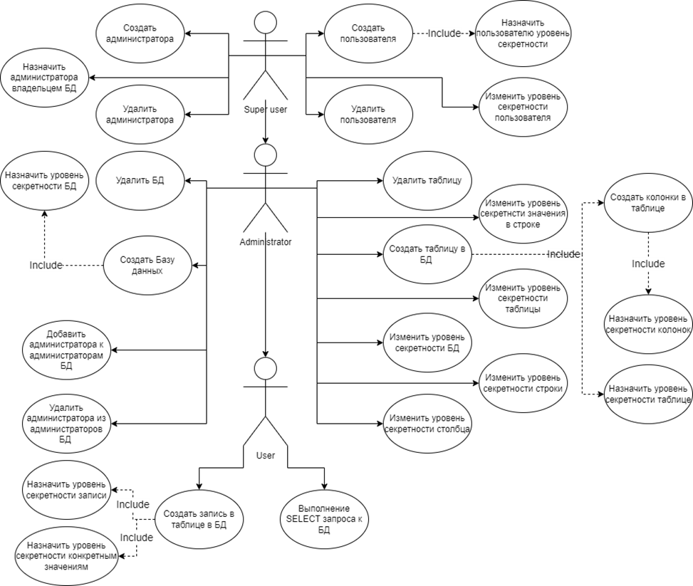
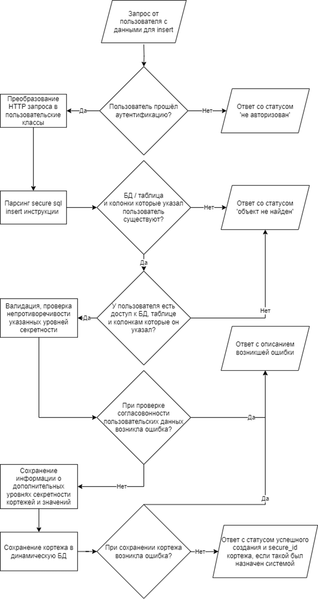
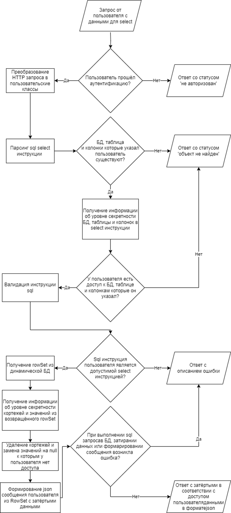

## Требования к приложению  
Поскольку наиболее распространённые современные СУБД не поддерживают мандатную модель безопасности необходимо разработать приложение, которое будет работать поверх реляционных СУБД и предоставлять функционал по поддержки данной модели.  
Приложение должно иметь поддержку мандатной модели безопасности на уровнях баз данных, таблиц, столбцов, кортежей и конкретных значений. Пользователи или администраторы должны иметь возможность назначить метку безопасности каждому объекту СУБД из перечисленных. Другими словами, должна быть возможность назначить уровень секретности как конкретному значению в конкретном кортеже, так и самому кортежу, в которой указано это значение, и таблице, в которой находится кортеж, и базе данных, в которой находится таблица.  В метке безопасности должна быть возможность выбрать из следующих уровней секретности, указанных в порядке доминирования от слабых к более сильным:
1. несекретно;
2. секретно;
3. совершенно секретно;
4. особой важности;

При создании БД ей всегда должен назначаться какой-либо уровень секретности. При создании других объектов СУБД их уровень секретности может не указываться пользователями и тогда он должен являться равным родительскому уровню секретности. Например, если при создании таблицы в БД не указать её уровень секретности, то он должен быть назначен равным уровню секретности БД, в которой эта таблица создаётся. Также не должно быть возможности назначить уровень секретности дочернего объекта ниже уровня секретности родительского. Так, например, не должно быть возможности назначить колонке уровень NOT_SECRET, когда таблица с этой колонкой имеет уровень SECRET. Уровни секретности дочерних объектов могут быть только выше или равными уровням родительских объектов.  
В приложении должны существовать следующие роли пользователей, образующие иерархию и указанные по увеличению количества полномочий и зон ответственности: 
1. пользователь;
2. администратор базы данных;
3. суперпользователь;  

Приложение не должно зависеть от конкретной реализации реляционной СУБД. Приложение должно предоставлять возможность его настройки для выбора конкретной СУБД для хранения создаваемых баз данных, таблиц и записей в них. Взаимодействие с приложением должно осуществляться через REST-интерфейс. Одной из основных задач при разработке приложения должно являться обеспечение пользователя максимально sql-подобным синтаксисом. Пароли пользователей должны храниться либо в зашифрованном виде, либо должны храниться только хэш суммы этих паролей.

## Use-case диаграмма

## Диаграмма состояний вставки кортежа

## Диаграмма состояний select операции

